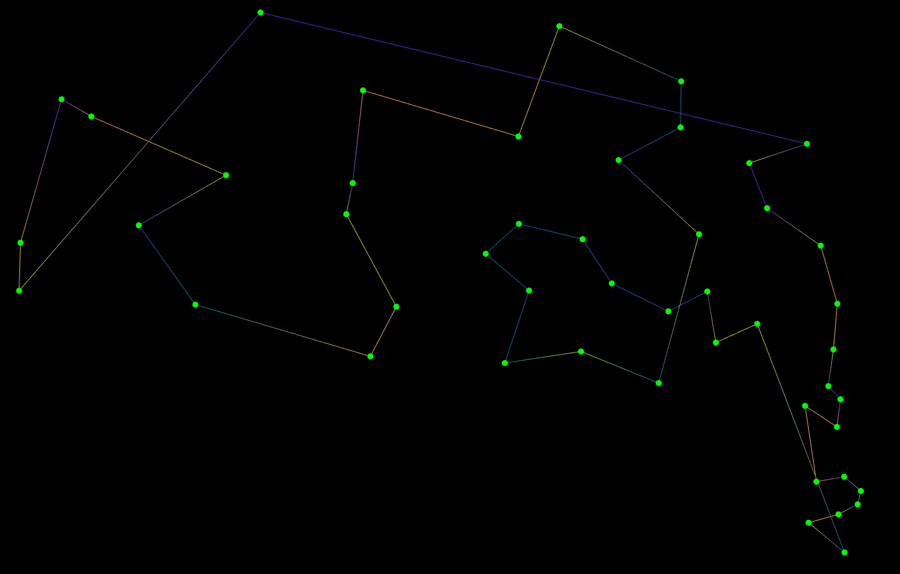
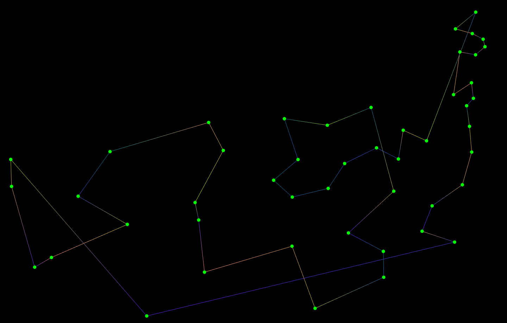

# Bahçeşehir University - CMP3004 Project

## Travelling Salesman Problem in C++(20)

**Solving the classic TSP with some popular algorithms like
Exhaustive Search, O(n!), Greedy Nearest Neighbour, O(n²), Divide and Conquer O(TODO),
Genetic Algorithm O(TODO)**

## Dependencies

There are two directories for two different things.

One is just for visualization, not really it does some basic searches, that's unused,
and unattended.

The other (`no-visuals`) is the main focus, the algorithms should be developed on there.

There is already some basic infrastructure for them, no need to read from a
file, the cities are already in the `City.hpp` file

Currently I'm using [{fmt}](https://fmt.dev/) for my io needs, if you
don't want to install it, go through the code and replace `fmt::print()`
calls with `std::cout`

A `C++2a` compatible compiler is required, I'm using GCC-10.1,
clang-10/11 is also supported

## Screenshots

_**TODO**_

## Usage

_**TODO**_

Run `tup` if you have it installed [tup](http://gittup.org/tup)

That will build and link the files in their own directories, so
the executable for `sfml-visuals` will be in there named `TSP_Window`

## Contributors

- Eren ÖZDEMİR
- Oktay Mert AKÜZÜM
- Onur Orkun KADER

